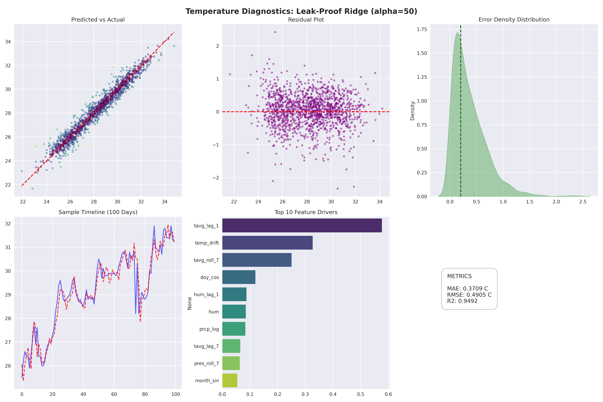
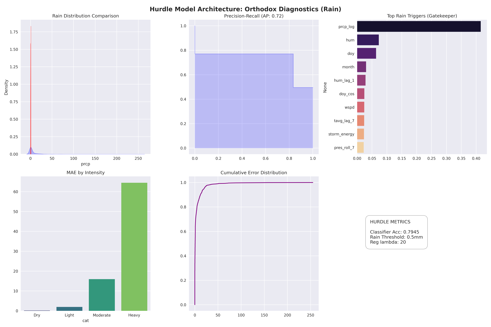
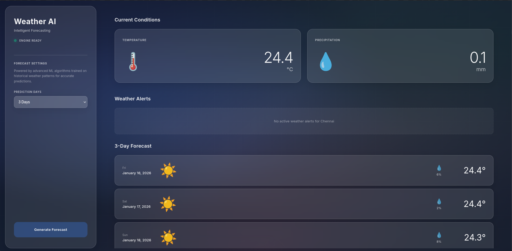

# Weather Prediction App — Ridge Regression + XGBoost Hurdle Model

This is a project I made to mess around with machine learning and see if I could build a decent weather forecasting system. Basically just experimenting with different ML techniques and learning how to deploy models in a web app.

## Introduction

This project started as an attempt to build a weather forecasting system from scratch using machine learning. The goal was simple: predict temperature and rainfall for Chennai using historical weather data. What made it interesting was implementing the entire pipeline - from data fetching to model training to web deployment.

**Note:** The models are currently trained specifically for Chennai weather patterns. Using them for other locations will give poor results since the model learned Chennai's tropical coastal climate characteristics.

The system uses Ridge Regression (with L2 regularization, alpha=50) for temperature because Chennai's temperature is fairly stable and linear. For precipitation, I used an XGBoost Hurdle Model because rainfall is tricky - most days have zero rain, and when it does rain, the amount varies a lot. The hurdle approach handles this by first predicting if it will rain (classification), then predicting how much (regression on log-transformed values).

## Installation and Running

```bash
# Clone repository
git clone https://github.com/yourusername/Weather-prediction-app-Why-Why-Not-.git
cd Weather-prediction-app-Why-Why-Not-

# Run the app (installs dependencies, trains model if needed, starts server)
python main.py
```

The launcher will automatically:
1. Install all dependencies from requirements.txt
2. Check for the trained model, train it if missing
3. Start the Django server

Access at `http://127.0.0.1:8000/`

## How This Was Built

I built the weather engine and all the math stuff myself - the Ridge regression, the hurdle model logic, the R2 calculations, and making sure there's no data leakage. I spent time getting those right because the predictions need to be scientifically sound.

For the frontend UI, I used AI tools to help design and iterate on the frosted glass interface. It would have taken me weeks to get that polished look on my own, but with AI assistance I got it done much faster. The AI helped with the CSS styling and the interactive elements, while I focused on making sure the backend predictions were accurate.

## Technical Stack

**Backend:**
* Python 3.13
* Django 6.0.1 for the web framework
* Scikit-learn for Ridge Regression
* XGBoost for precipitation models
* Pandas/NumPy for data processing
* Open-Meteo API for weather data

**Frontend:**
* Vanilla JavaScript (no frameworks)
* CSS with glassmorphism effects
* Responsive design

**Logging System:**
* Custom `auto_logger.py` that captures all console output
* Timestamps every operation
* Stores logs in `logs/` directory with session identifiers
* Uses `sys.excepthook` to catch and log exceptions

**Model Architecture:**
* Temperature: Ridge Regression with 34 engineered features
* Precipitation: XGBoost Classifier (300 estimators, λ=50) + Dual XGBoost Regressors (reg:squarederror and reg:gamma)

## Feature Engineering

The models don't use raw weather data. Instead, I engineered 34 features from the base measurements:

**Cyclical Time Features:**
```python
# Encode day of year and month as sin/cos to capture seasonality
df['doy_sin'] = np.sin(2 * np.pi * df['doy'] / 365.25)
df['doy_cos'] = np.cos(2 * np.pi * df['doy'] / 365.25)
df['month_sin'] = np.sin(2 * np.pi * df['month'] / 12)
df['month_cos'] = np.cos(2 * np.pi * df['month'] / 12)
```

**Lag Features:**
```python
# Previous values (1, 7, 14 days back)
for col in ['tavg', 'prcp', 'pres', 'wspd', 'hum']:
    for lag in [1, 7, 14]:
        df[f'{col}_lag_{lag}'] = df[col].shift(lag)
```

**Rolling Averages:**
```python
# 7-day rolling mean (shifted by 1 to prevent data leakage)
df[f'{col}_roll_7'] = df[col].shift(1).rolling(7).mean()
```

**Derived Features:**
```python
# Pressure change (indicates weather system movement)
df['pres_delta_24h'] = df['pres'].shift(1).diff(1)

# Temperature drift from weekly average
df['temp_drift'] = df['tavg'].shift(1) - df['tavg'].shift(1).rolling(7).mean()

# Storm energy proxy
df['storm_energy'] = (df['wspd'].shift(1)**2) * (1013 - df['pres'].shift(1))
```

All features are shifted by at least 1 day to prevent data leakage - the model can only use information that would have been available before the prediction date.

## Training Output

Here's the actual output from the latest training run (from `logs/weather_engine_architect_final@2026-01-15_12-26-15.log`):

```
[12:26:15] ================================================================================
[12:26:15] SYSTEM INITIALIZATION: CHENNAI ARCHITECT ENGINE
[12:26:15] ================================================================================
[12:26:15] [INIT] Target Coordinates: (13.0836939, 80.270186)
[12:26:15] [INIT] Architecture: Leak-Proof Hurdle + Generalization Guard

[12:26:15] --- PHASE 1: MASTER DATA INGESTION (Open-Meteo) ---
[12:26:15] [REQ] Date Range: 2000-01-12 to 2026-01-15
[12:26:17] [SUCCESS] Ingested 9501 records. Memory: 593.9KB

[12:26:17] --- PHASE 2: LEAK-PROOF FEATURE PIPELINE ---

[12:26:17] --- PHASE 3: TEMP TRAINING & GENERALIZATION GUARD ---
[12:26:17]    CV R2 Stability: 0.9644
[12:26:17]    Train R2: 0.9672 | Test R2: 0.9492
[12:26:18]    [ARCHIVE] graphs/temperature_performance_20260115-122617.png

[12:26:30] --- PHASE 4: PRECIPITATION HURDLE ---
[12:26:31] [VIZ] Launching Robust Precipitation Dashboard...
[12:26:32]    [ARCHIVE] graphs/precipitation_performance_20260115-122632.png
[12:26:42]    [ARCHIVE] graphs/feature_correlation_20260115-122642.png

[12:26:44] ================================================================================
[12:26:44] FINAL SYSTEM ARCHITECT AUDIT & MODEL DETAILS
[12:26:44] ================================================================================
[12:26:44] [AUDIT] FEATURE MATRIX DETAILS
[12:26:44]   -> Total Unique Signals: 34

[12:26:44] [AUDIT] TEMPERATURE MODEL (RIDGE)
[12:26:44]   -> CV R2 Stability:      0.9644
[12:26:44]      * tavg_lag_1           : +0.57697299
[12:26:44]      * temp_drift           : +0.32672549
[12:26:44]      * tavg_roll_7          : +0.25024750
[12:26:44]      * doy_cos              : -0.11964995
[12:26:44]      * hum_lag_1            : +0.08731775

[12:26:44] [AUDIT] PRECIPITATION MODEL (XGBOOST HURDLE)
[12:26:44]   -> Classifier Estimators: 300
[12:26:44]   -> L2 Regularization (λ): 50

[12:26:44] ALL SYSTEMS VERIFIED AND ARCHIVED.
```

## Model Performance

**Temperature Model:**
* Test R²: 0.9492 (explains 94.92% of variance)
* CV R² Stability: 0.9644 (5-fold time series cross-validation)
* Top predictor: `tavg_lag_1` (yesterday's temperature, β=0.577)

The high R² makes sense for Chennai - it's a coastal tropical city with very stable temperatures. The temperature rarely swings more than 5-6°C throughout the year.

**Precipitation Model:**
* Architecture: Two-stage hurdle model
* Stage 1: XGBoost Classifier (will it rain? threshold 0.5mm)
* Stage 2: Ensemble of two XGBoost Regressors (how much?)
  * Regressor 1: `reg:squarederror` objective
  * Regressor 2: `reg:gamma` objective (better for skewed distributions)
* Final prediction: Mean of log-transformed outputs, then expm1

The hurdle approach was necessary because Chennai has a lot of dry days (zero rainfall), which creates a zero-inflated distribution that standard regression can't handle well.

## Performance Graphs

Training generates three diagnostic plots:

**Temperature Performance:**


Shows predicted vs actual, residual plot, error distribution, timeline comparison, feature importance, and metrics.

**Precipitation Performance:**


Shows rain distribution comparison, precision-recall curve, feature importance for the classifier, MAE by intensity category, cumulative error distribution, and hurdle metrics.

**Feature Correlation:**


Correlation matrix of the top 15 features to check for multicollinearity.

## Web Application

The Django app provides a simple interface:


**Main Page:**
* Shows current temperature and precipitation
* Engine status indicator (online/offline)
* Forecast settings (3, 5, 7, 10, or 14 days)
* Generate forecast button

**API Endpoints:**
```
GET /                                    # Main dashboard
GET /generate_forecast/?days=7           # Generate 7-day forecast
GET /generate_forecast/?days=7&test_date=2025-07-15  # Test with custom date
GET /get_alerts/                         # Weather alerts (placeholder)
```

**Example API Response:**
```json
{
  "forecasts": [
    {
      "date": "2026-01-16",
      "day": "Fri",
      "full_date": "January 16, 2026",
      "temp": 24.37094298060054,
      "precip": 0.0,
      "prob": 6,
      "icon": "sun"
    }
  ]
}
```

The frontend rounds temperature to 1 decimal place for display (e.g., 24.4°C), but the backend sends raw float values.

## Data Pipeline

**Data Source:** Open-Meteo Historical Weather API

**Variables Used:**
* `temperature_2m_mean` - Daily average temperature
* `temperature_2m_max` - Daily maximum
* `temperature_2m_min` - Daily minimum
* `precipitation_sum` - Total daily precipitation
* `wind_speed_10m_max` - Maximum wind speed
* `surface_pressure_mean` - Average surface pressure
* `relative_humidity_2m_mean` - Average relative humidity

**Preprocessing:**
1. Fetch data from API (9500+ days, 2000-2026)
2. Handle missing values (linear interpolation, then forward/backward fill)
3. Clip precipitation to non-negative values
4. Engineer 34 features from 7 base variables
5. Drop first 30 rows (lost to lag features)
6. Scale features using RobustScaler for precipitation model

## Retraining Models

To retrain with fresh data:

```bash
python weather_engine.py
```

This will:
1. Fetch latest data from Open-Meteo
2. Engineer features
3. Train both models
4. Generate diagnostic plots
5. Save models to `saved_models/weather_engine.joblib`
6. Log everything to `logs/`

Training takes about 30 seconds on a modern CPU.

## Known Issues

1. **API Rate Limiting:** Open-Meteo sometimes returns empty payloads if you make too many requests. The code handles this gracefully but you might need to wait a few minutes.

2. **Precipitation Accuracy:** The precipitation model is less accurate than temperature (which is expected). Rainfall is inherently harder to predict than temperature.

3. **Location Specific:** Models are trained specifically for Chennai. Using them for other locations will give poor results. You'd need to retrain with data for that location.

4. **Future Dates:** The model can generate predictions for any date, but accuracy degrades quickly beyond 7-10 days due to error accumulation in the autoregressive features.

## Project Structure

```
Weather-prediction-app-Why-Why-Not-/
├── weather_engine.py          # Core training script
├── auto_logger.py             # Logging system
├── manage.py                  # Django entry point
├── requirements.txt           # Dependencies
├── .gitignore                 # Git ignore rules
├── saved_models/
│   └── weather_engine.joblib  # Trained model (3.4MB)
├── graphs/                    # Training diagnostics
│   ├── temperature_performance_*.png
│   ├── precipitation_performance_*.png
│   └── feature_correlation_*.png
├── logs/                      # Training session logs
│   └── weather_engine_architect_final@*.log
├── weather/                   # Django app
│   ├── views.py              # API logic
│   └── urls.py               # URL routing
├── weather_project/          # Django settings
│   ├── settings.py
│   └── urls.py
├── templates/
│   └── weather/
│       └── index.html        # Main UI
└── static/
    ├── css/
    │   └── styles.css        # Glassmorphism UI
    └── js/
        └── app.js            # Frontend logic
```

## Future Improvements

* Support for multiple cities (currently only Chennai - would need to retrain models for each location)
* Implement LSTM or Transformer models for better long-term predictions
* Add confidence intervals to predictions
* Add historical comparison (predicted vs actual for past dates)
* Mobile app version

## References

* Open-Meteo API: https://open-meteo.com/
* Ridge Regression: Hoerl & Kennard (1970)
* XGBoost: Chen & Guestrin (2016)
* Hurdle Models: Cragg (1971)

## License

MIT License - use however you want, but no guarantees.
